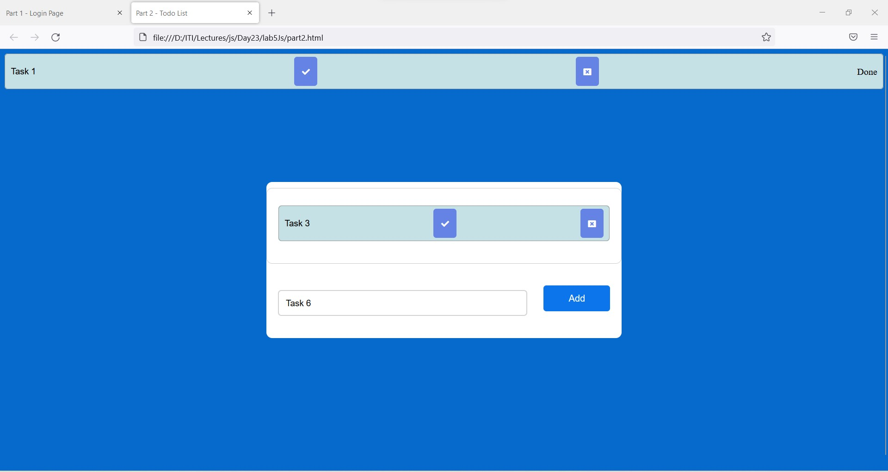

# Part1 - Login Form
> Create login page and when user press login button create object login that hold
 the data and if username = admin and password = 123 show him message
 “welcome” , else show him message “not registered”
 don’t use alert or prompt , use dom to get the data from user and display it

## part1 Login Form - admin
 
## part2 Login Form - other
 

# part2 - Todo List
> Create Todo list app similar to this ,
  when user write task name and press add new task will be added to tasks list
  When user click the done mark in green the task status will be updated to done
  When user click the delete button , the task should be deleted from list

## part1 Todo List - add without enter any data
 
## part2 Todo List - add task name and press add
 
## part3 Todo List - click the done mark & update status
 
## part3 Todo List - add some tasks before click delete
 
## part3 Todo List - click the delete button for task 6 and task 2
 